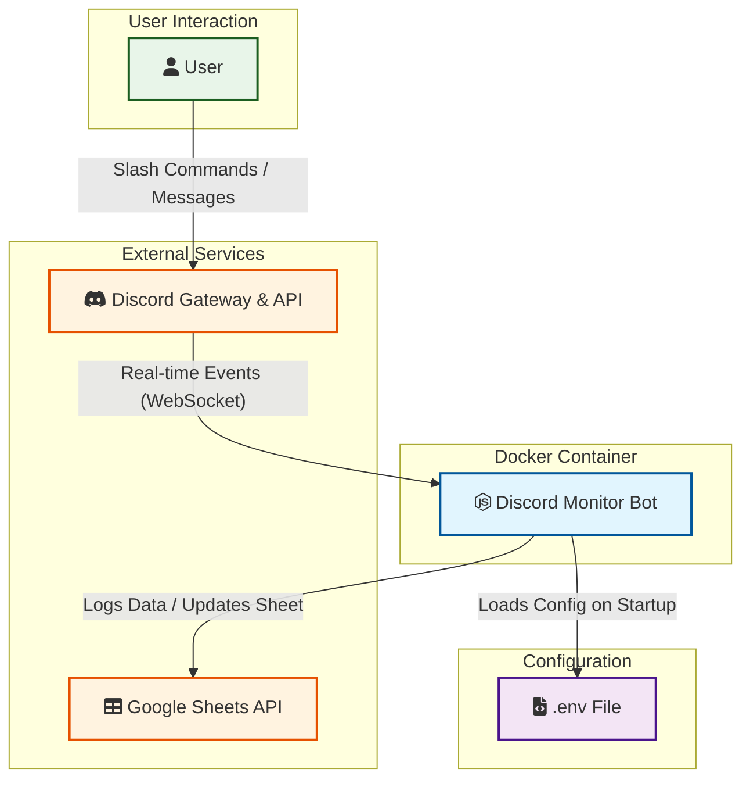

# System Architecture

本文件說明 `discord-monitor` 的運作架構與資料流向。

## 架構圖 (Architecture Diagram)

## 元件說明

1.  **Discord Monitor Bot**: 核心應用程式，基於 Node.js 開發。負責監聽 Discord 事件並處理邏輯。
2.  **Discord Gateway & API**: 提供即時事件（如訊息、語音狀態變更）以及 Slash Command 的互動介面。
3.  **Google Sheets API**: 作為資料庫使用，儲存監控到的數據與日誌。
4.  **.env File**: 儲存敏感設定，如 Discord Token 與 Google Credentials。